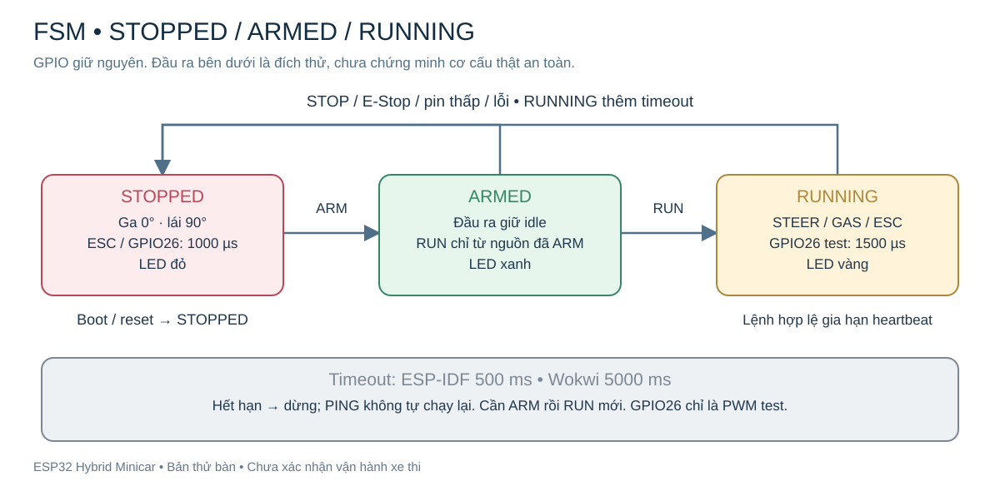
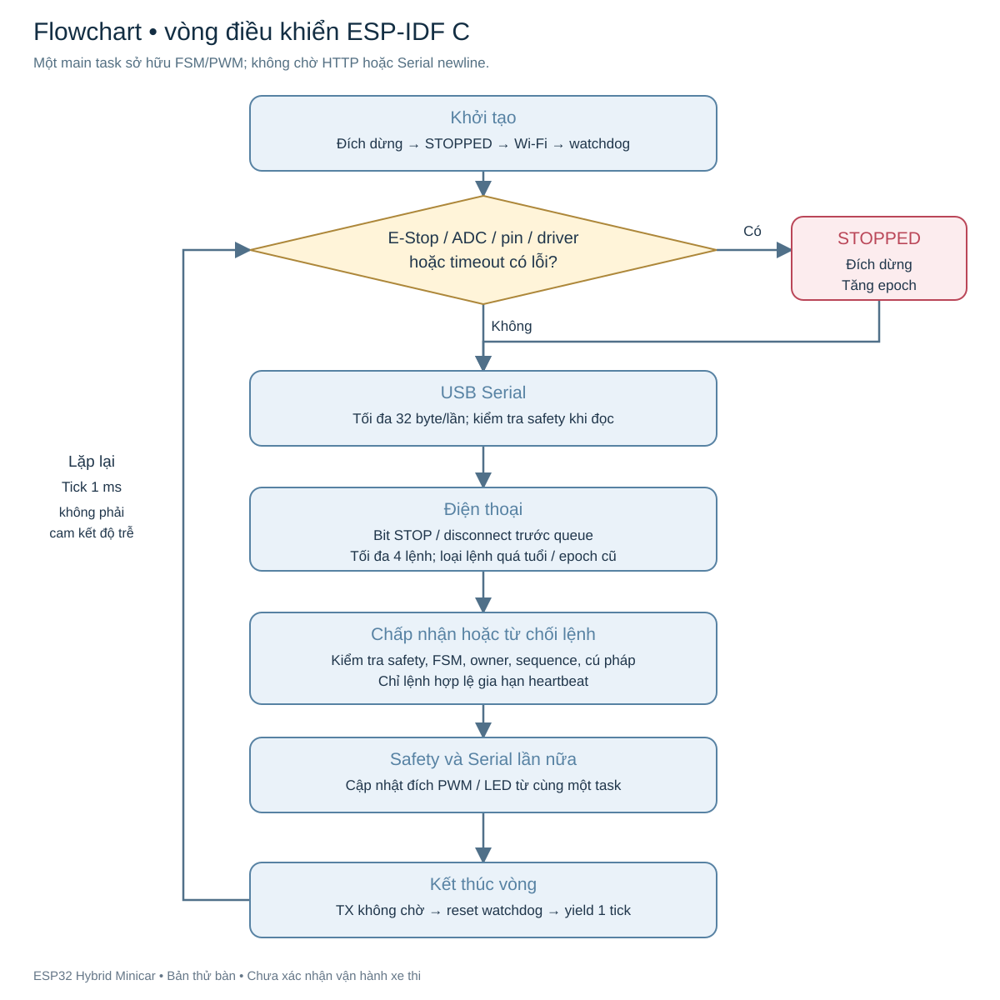
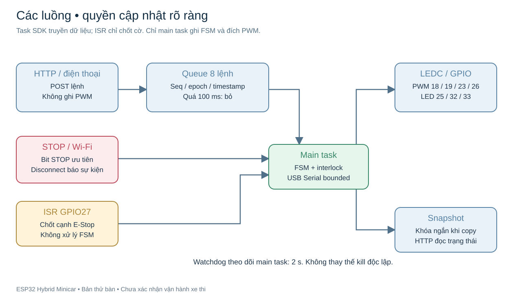
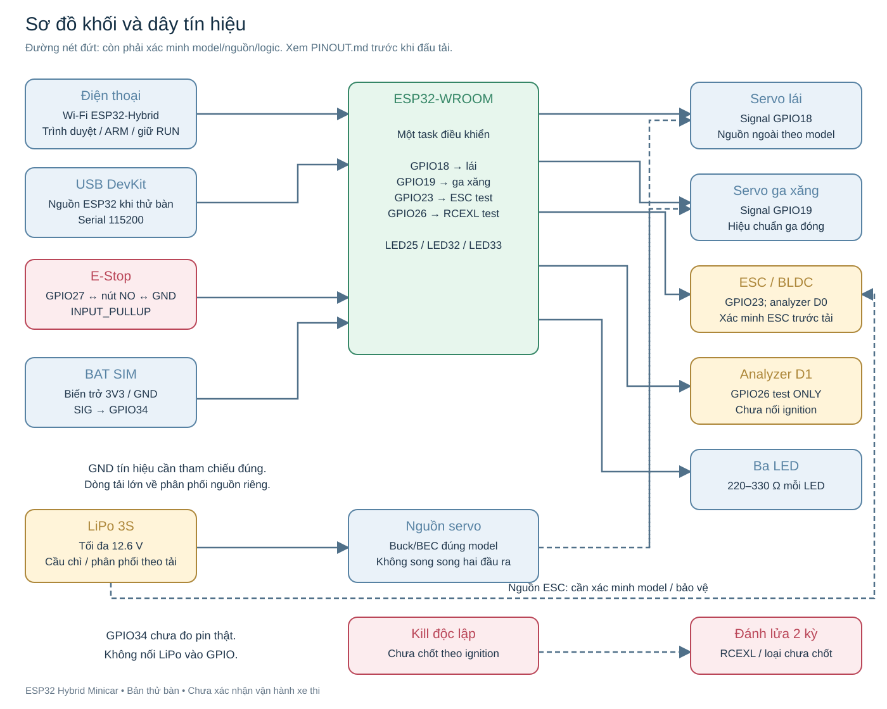

# Sơ đồ hệ thống, FSM và flowchart

Bản SVG mở trực tiếp trên GitHub/trình duyệt, không cần Mermaid hay dịch vụ dựng hình. Sơ đồ được tạo từ firmware hiện tại; phần nguồn/ignition thiếu model được đánh dấu. [Bảng pinout và dây servo](../docs/PINOUT.md) là tài liệu đấu tín hiệu kèm theo.

## FSM

## Flowchart

## Các luồng và quyền cập nhật

Tick 1 ms không bảo đảm mỗi vòng hoàn tất trong 1 ms. Timeout logic 500 ms còn cộng trễ lập lịch/PWM/cơ khí. Watchdog 2 s không thay kill độc lập.

## Toàn hệ thống

GND ESP32/servo/ESC/analyzer cần tham chiếu đúng; dòng servo/motor đi riêng về phân phối. Không nối đầu ra buck/BEC song song. Không nối GPIO26 vào ignition chỉ vì thấy xung analyzer. Chưa gán GPIO relay/kill, chưa dùng GPIO34 đo pin thật; nguồn/cách ly ignition theo manual đúng model.

SVG được tạo bằng `node scripts/render-schematics.mjs`, không cần cài package. Nguồn vẽ là mã JS trong repo; mở từng SVG để phóng to hoặc in.
