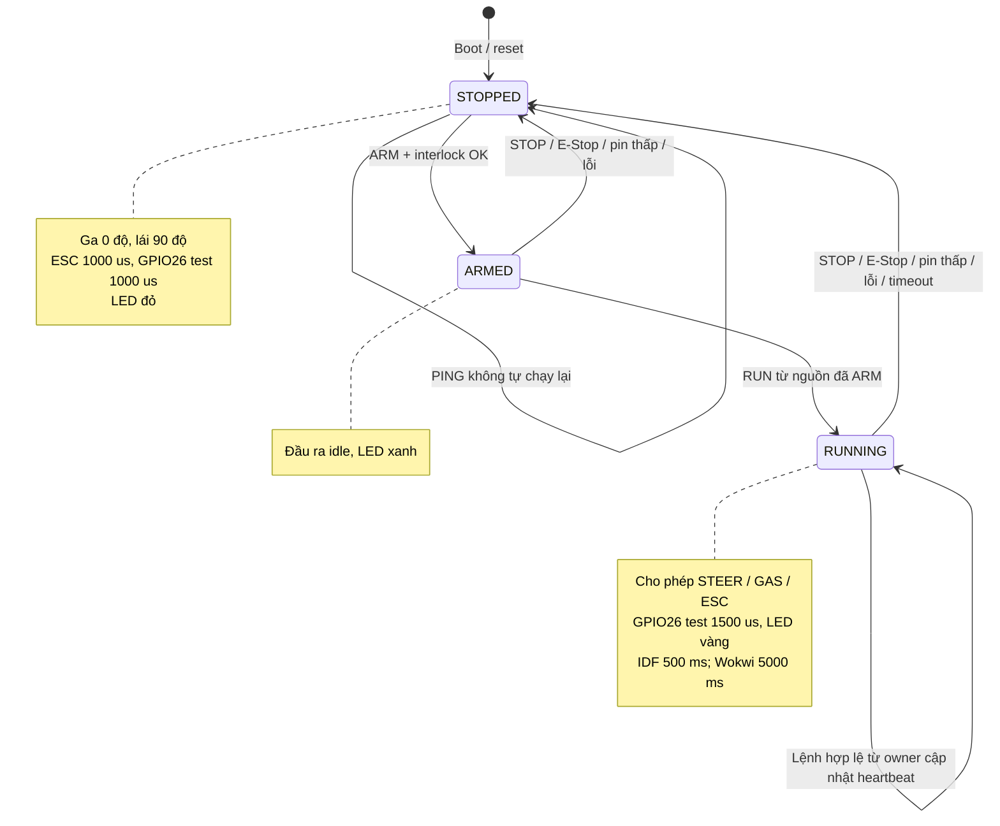
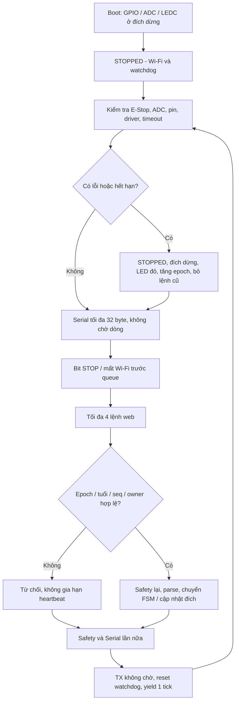
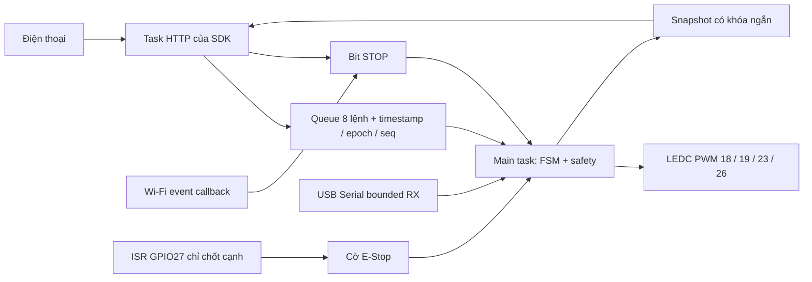
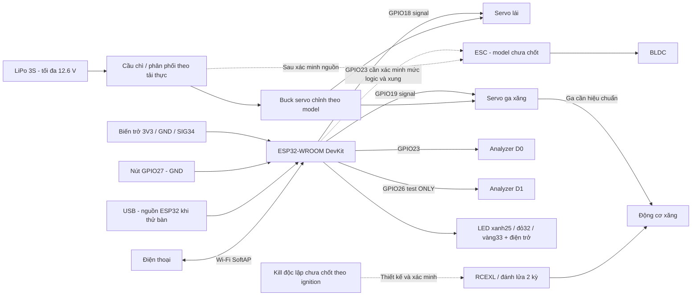

# Sơ đồ tự tạo theo firmware

Mermaid hiển thị trực tiếp trên GitHub. Đây là kiến trúc, FSM và luồng xử lý; [PINOUT](../docs/PINOUT.md) là bảng đấu tín hiệu. Phần nguồn/ignition thiếu model được đánh dấu, chưa là sơ đồ nguyên lý đã duyệt cho xe thi.

## FSM

## Flowchart

Tick 1 ms không bảo đảm vòng lặp hoàn tất trong 1 ms. Chỉ main task ghi FSM/PWM; LEDC tạo xung bằng phần cứng.

## Toàn hệ thống

GND tín hiệu ESP32/servo/ESC/analyzer cần tham chiếu đúng; dòng servo/motor đi riêng về phân phối. Không nối đầu ra buck/BEC song song. Không nối GPIO26 vào ignition chỉ vì thấy xung analyzer. Chưa gán GPIO cho relay/kill, chưa dùng GPIO34 đo pin thật. Nguồn/cách ly ignition theo manual đúng model.
